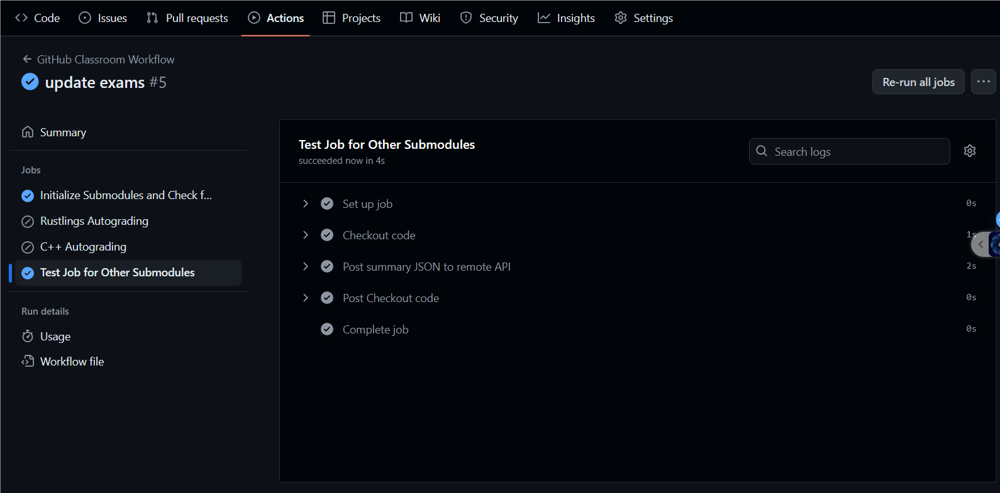

# Exam Grading 自动测试评分系统使用教程

按此教程操作，完成构建自己的评测系统用于后续阶段的测验提交，并熟悉评测系统的使用。下列步骤完成了 3 项工作：

1. 准备 Git 环境
2. 获取 exam-grading 源码
3. 测验评分

## 步骤

### 1. 准备 Git 环境

Git 的安装可参考：[1.5 起步 - 安装 Git](https://git-scm.com/book/zh/v2/%E8%B5%B7%E6%AD%A5-%E5%AE%89%E8%A3%85-Git) 或 [InfiniTensor 训练营导学阶段指导书](https://17999824wyj.github.io/InfiniTensor-camp-book-stage0/ch1-01.html)

### 2. 获取exam-grading源码

学员需要通过 [exam-grading模板](https://github.com/LearningInfiniTensor/exam-grading) 创建自己的评分系统仓库：


> **NOTICE** 推荐创建为private仓库

之后将创建的exam-grading仓库拉取到本地

```bash
git clone <repo-addr> ./exam-grading
cd exam-grading
```

### 3. 测验评分

该部分将通过给评分系统添加exams目录以演示测验评分系统的使用方法。

首先需要在Github上创建一个测试仓库（只需包含一个README即可），权限设置为 `public`，否则之后测试拉取会因为没有权限而报错找不到仓库。创建好测试仓库之后可通过两种方式添加将该测试仓库添加至评分系统：[直接目录](#31-直接目录)和[子模块](#32-子模块)

> **NOTICE** 推荐使用子模块方式添加测试目录

#### 3.1 直接目录

通过直接目录的方式添加测试目录，需要学员将目标测试目录克隆到评分系统中：

```bash
git clone <target-test-repo> ./exams
cd exams
# 确保为最新
git pull
```

#### 3.2 子模块

子模块方式则只需将对应测试目录以子模块的方式加入评分系统即可：

```bash
git submodule add <target-test-repo> ./exams
# 确保为最新
git submodule update --remote
```

添加测试目录后，学员即可提交更改到远程仓库，评测系统将会自动运行，运行结果可以在仓库actions界面查看：


目标运行结果：



## 其它

Git子模块的使用可参考 [7.11 Git 工具 - 子模块](https://git-scm.com/book/zh/v2/Git-%E5%B7%A5%E5%85%B7-%E5%AD%90%E6%A8%A1%E5%9D%97)

运行过程中产生的问题请查阅[Q&A](../qa/doc.md)，或在微信群聊中咨询助教老师
