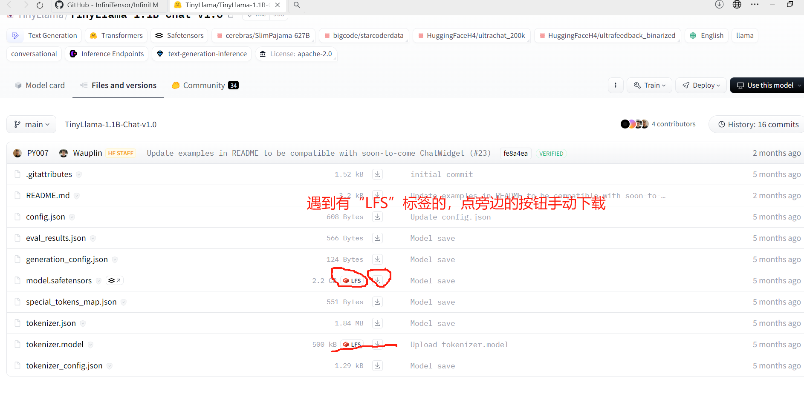
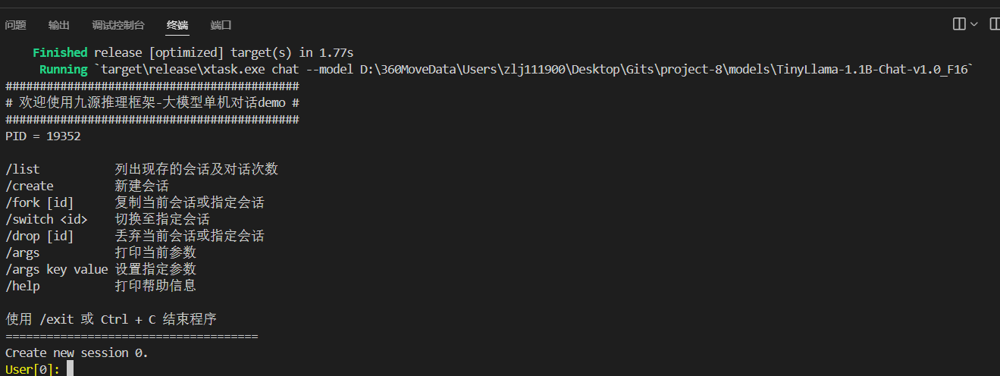

# 基于Rust的大模型推理引擎下载教程

@Author:        abcd1234
@Time:          2023-05-21
@E-mail:        abcd1234dbren@yeah.net
@Environment    win11家庭中文版

## 大体步骤说明

1. 拉取引擎仓库
2. 下载模型
3. 编译模型
4. 运行推理引擎

## 详细步骤

### 1. 拉取引擎仓库

```bash
git clone https://github.com/InfiniTensor/InfiniLM
```

注：有时候网络质量不好导致拉取超时，则可以尝试等网络质量好的时候再下载！

### 2. 下载模型

#### 下载命令

注：此部分以“TinyLlama-1.1B-Chat-v1.0”模型为例，此模型的源下载网站为：“ https://huggingface.co/TinyLlama/TinyLlama-1.1B-Chat-v1.0 ”（需要魔法），建议使用 “ https://hf-mirror.com/TinyLlama/TinyLlama-1.1B-Chat-v1.0 ”的镜像，下面以从镜像网站下载为例：

输入命令：

```bash
GIT_LFS_SKIP_SMUDGE=1 git clone https://hf-mirror.com/TinyLlama/TinyLlama-1.1B-Chat-v1.0
```

#### 参数解释：

GIT_LFS_SKIP_SMUDGE=1：跳过LFS的smudge操作，即跳过LFS的文件预处理操作。

因为模型中，有一个“模型参数”文件，其占用磁盘较大，示例占了2.2G，导致git拉取时，极其容易超时，所以使用此参数跳过此文件，之后我们手动对需要用LFS下载的文件进行下载。

#### 手动下载方式：

在镜像网站上，点击下面框起来的内容：


注：手动下载的两个文件，一定要放置到刚刚用git下载的目录里！

### 3. 编译模型

#### 目录路径展示

此部分为展示我的目录路径，不需要读者做相同操作，只是方便读者阅读使用。

```python
D:/project-8/
|-- InfiniLM
    |-- # 此部分就是引擎仓库，具体内容除Cargo.toml，略
    |-- Cargo.toml
    |-- ...
|-- models
    |-- # 此部分是模型文件夹，我用它来存放所有的模型
    |-- TinyLlama-1.1B-Chat-v1.0
        |-- # 此部分就是刚刚下载的模型，里面必须至少有以下3种文件：
        |-- config.json                 # 模型配置文件
        |-- model.safetesnors           # 模型参数文件
        |-- tokenizer.model/vocab.txt   # 分词器词表
        |-- ...
    |-- TinyLlama-1.1B-Chat-v1.0_F16
        |-- # 此部分最开始没有，在我们“精度转化”操作后，得到此文件夹
        |-- ...
|-- reports
    |-- # 此部分是我存放报告用的
    |-- ...
```

#### 精度转化

```bash
cd InfiniLM # 切换至InfiniLM目录内
# 然后参照官方文档
# 我们直接编译刚刚下载的模型，要先转化精度为f16
# 我的目录路径如上所示，请自行修改下面参数：
cargo cast --model D:/project-8/models/TinyLlama-1.1B-Chat-v1.0/ --dt f16
# 然后，就会在 D:/project-8/models/ 文件夹内生成一个 TinyLlama-1.1B-Chat-v1.0_F16 文件夹
```

### 4. 运行推理引擎

```bash
cd InfiniLM # 切换至InfiniLM目录内
# 然后参照官方文档，即可完成
cargo chat --model D:/project-8/models/TinyLlama-1.1B-Chat-v1.0_F16
```

展示输出：


## 附录

### 允许设备

目前来看，大部分设备都应该可以，甚至手机也可以！
我的电脑内存16G，可以允许，大约消耗了磁盘10G以内的空间

### rust配置

在windows上的rust配置，可以自行搜教程，如果我没记错，在VS-Code里面直接装“rust-anaylzer”这个插件就行了，不用很麻烦。
也可能会需要再去配置rustc工具链，但我不记得我在windows下配置过。
