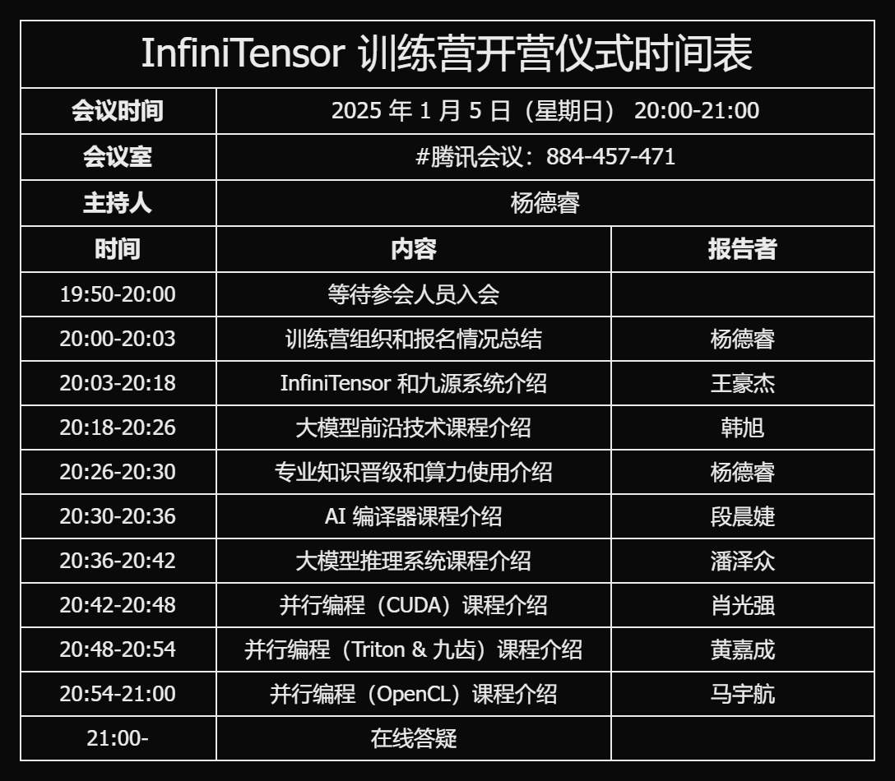
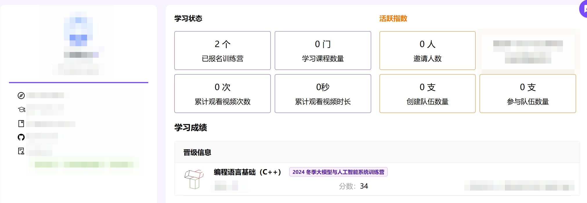

# 大模型与人工智能系统训练营

[Github 讨论](https://github.com/orgs/LearningInfiniTensor/discussions)
|
[**常见问题**](../qa/doc-2024w.md)

| 序号 | 季度 | 时间 | 教学网站
|:---:|:----:|:---:|:-:
| 1 | 2024 夏季 | 2024.07.06 - 2024.09.29 | [opencamp.cn/InfiniTensor/2024summer](https://opencamp.cn/InfiniTensor/camp/2024summer)
| 2 | **2024 冬季** | 2024.12.14 - 2025.03.22 | [opencamp.cn/InfiniTensor/2024winter](https://opencamp.cn/InfiniTensor/camp/2024winter)

## 开营 🎉

2025 年 1 月 5 日晚 20:00 将于 [#腾讯会议：884-457-471](https://meeting.tencent.com/dm/I9qQfw3KHOpm) 举行 2024 冬季大模型与人工智能系统训练营开营仪式。

人工智能系统专业知识直播课程将于 1 月 6 日下午正式开始，配套算力资源也将陆续上线。专业知识课程将提供配套交流群供学员交流讨论。为降低管理压力，要求学员完成系统编程语言基础作业并提交到课程平台，然后方可进群。请学员于 1 月 2 日 8:00 后将个人中心页面（包含基本信息和成绩单）截图发送给助教老师，由助教老师邀请进群。

截图示例：

## 课程体系

本次训练营包含系统编程语言基础、人工智能系统专业知识、人工智能系统实践项目 3 组训练项目。系统编程语言基础项目要求学员掌握 C++ 语言或 Rust 语言的基本语法和标准库使用方式，学习方式为视频录播课 + 编程作业 + 微信群讨论答疑结合。

人工智能系统专业知识项目要求学员掌握至少一种人工智能系统必要的体系化知识，学习方式为视频直播课 + 编程作业 + 微信群讨论答疑结合。课程包括 4 类 6 门，每门课 5 课时。4 类课程是 AI 编译器、大模型推理系统、并行编程语言和大模型前沿技术，其中并行编程语言分为 CUDA、OpenCL 和 Triton/九齿 3 个方向；大模型前沿技术为讲座课，不设置作业。

人工智能实践项目要求学员独立或小组完成一个人工智能系统方面实践项目，可以是从零开始实现一个人工智能编译器，或为现有人工智能系统添加功能/优化性能等任务。专业知识课程结束时，除大模型前沿技术外，其他 5 门课将各提供至少一个项目选题供学员完成，学员也可以自行选题并与项目导师交流完成要求和评分标准。

## 晋级和评分方式

编程语言基础、专业知识两项采用评分系统自动评分，产生通过和不通过 2 个成绩级别；实践项目由项目导师决定评分方式，产生优秀、通过和不通过 3 个成绩级别。

为了降低管理压力，本课程原则上要求学员按阶段学习，即完成编程语言基础后可参加专业知识学习，完成专业知识学习后可参加实践项目。所有课程签到、观看直播课不受约束，可随时参加，但需凭晋级凭证才能加入下一阶段微信群参与讨论。

学员报名后可直接加入微信群，并开始学习编程语言基础课程、完成作业。编程语言基础课程只为保证学员有足够的编程技能以完成专业知识学习，因此允许学员用夏季训练营或其他训练营的作业项目直接提交。鼓励有余力的学员两个作业都做。凭 C++ 或 Rust 作业满分记录，可向助教申请加入专业课群。

晋级专业阶段的学员可自由选课，鼓励同时学习多门课程。专业课程中，并行编程类 CUDA/Triton 方向课程要求学员有受支持的硬件才能完成作业，学员可自行筹措硬件资源，本次训练营也将提供国产硬件算力供学员使用，使用方法和管理章程另行通知。凭至少一门专业课作业满分记录，可向助教申请加入项目群。

加入项目群后可立即进行选题开题并开始完成项目，项目的通过和优秀标准由项目导师决定。项目成绩即训练营最终成绩。

最终成绩为通过的学员可获得通过证书，优秀可获得优秀证书和奖品。根据项目工作，通过和优秀学员均可能获得实习和推荐实习机会。

## 相对上期的进步

1. 丰富课程体系，优化课程设置

   - 直播课程从 4 门增加到 6 门，扩充 2 门面向不同软硬件技术栈的并行编程语言；
   - 去除课程“方向”描述，改为“门/类”，强化课程之间的联系；
   - 编程语言基础从直播课改为观看录播直接做题，留出充分时间完成专业课程作业和项目；

2. 提供国产算力供并行编程学习

   详情见[国产算力使用指南](#国产算力使用指南)。

3. 招生人数增加

   夏季全程报名人数约 1000 人，冬季开营前招生已超过 2200 人。

## 课程内容和说明文档

### 系统编程语言基础 🧑‍💻💯

- [夏季训练营仪式回放 🎉🎉🎉](https://opencamp.cn/InfiniTensor/camp/2024winter/stage/0?tab=video)

- C++ 基础课程 ➕ [习题 learning-cxx](https://github.com/LearningInfiniTensor/learning-cxx)
  |
  [夏季课程视频](https://opencamp.cn/InfiniTensor/camp/2024summer/stage/1?tab=video)
  |
  [晋级榜单](https://opencamp.cn/InfiniTensor/camp/2024winter/stage/1?tab=rank)

- Rust 基础课程 🦀 [习题 rustlings](https://rustlings.cool/)
  |
  [夏季课程视频](https://opencamp.cn/InfiniTensor/camp/2024summer/stage/2?tab=video)
  |
  [晋级榜单](https://opencamp.cn/InfiniTensor/camp/2024winter/stage/2?tab=rank)

> 习题评分方式参见 [Exam Grading 自动测试评分系统使用教程](../exam-grading-user-guide/doc.md)。

### 人工智能系统专业知识

#### 国产算力使用指南

- [天数智芯](/server/iluvatar/doc.md)
- 沐曦集成电路 Comming...
- 摩尔线程 Comming...

### 深度学习基础知识 📖

- [张量 Tensor](../reading/tensor.md)

## 支持团队 🤝

[InfiniTensor](https://github.com/InfiniTensor) 是基于清华大学高性能所科研团队建立的开源组织，主要研究领域包括人工智能编译器、大模型推理系统和国产硬件的生态建设。团队成员来自清华大学、中科院计算所以及其他科研院所、企事业单位。组织成立以来，发展出下列主要项目：

### 深度学习编译器 [InfiniTensor](https://github.com/InfiniTensor/InfiniTensor)

InfiniTensor 是开源组织的第一个项目，也是组织名的来源。该项目使用 C++ 开发，接受加载 ONNX 表示的模型实现高效推理，结构简洁、易于学习。另外，InfiniTensor 还支持多种硬件加速。

### 大模型推理引擎 [InfiniLM](https://github.com/InfiniTensor/InfiniLM)

相对于复杂多样的小型模型，大语言模型规模庞大、结构单一，需要高度特化的推理引擎才能达到高效推理。InfiniLM 项目是专为大模型推理设计的高性能推理引擎，使用 Rust 语言开发，功能丰富且接口简单有效。拉取项目后，无需任何配置，可以一个命令实现大语言模型的本地部署*，开始对话。

> \* 仍然需要提前安装 Rust 开发环境、下载模型文件。如果需要 GPU 加速，还需要安装驱动。
