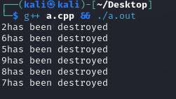

# InfiniTensor训练营（2024冬季）Q&A文档

## 编程语言基础阶段常见问题

1. C++ 或者 Rust 对后续专业阶段和项目阶段有什么影响吗？

   > AI 编译器采用 C++ 实现，大模型推理引擎采用 Rust 实现。鼓励学员们选择多个方向，难度都不是特别大，专业阶段中不同方向的上课时间也不同，不用担心上课时间冲突。

2. 夏季或其他训练营做过 C++/Rust 习题，还要重新做一遍吗？

   > 需要重新提交到本次训练营的排行榜。
   >
   > learning-cxx 比夏季题目多，满分 34，需要确认一遍哪些题可以直接用，哪些题要做。
   >
   > rustlings 满分仍是 94，可以直接提交。

3. `learning-cxx` 第 30 题评测和本地运行结果不同

   > 第 30 题涉及平台差异导致运行结果不同，需学员自行测试修改以通过评测系统为准
   > 
   > 

4. xmake 在 Windows 平台上检测不到 Visual Studio 环境问题

   > 运行 `xmake` 输出：
   >
   > ```bash
   > checking for platform ... windows
   > checking for architecture ... x64
   > checking for Microsoft Visual Studio (x64) version ... no
   > error: target(test): toolchain not found!
   > ```
   >
   > `xmake` 通过 `cl` 检测Visual Studio检测环境，然而命令行调用 `cl` 指令发现报错没有这个指令，之后找到 `cl.exe` 所在位置后添加到环境变量中再次运行 `cl` 后正常检测到环境，再次运行 `xmake` 编译也能够检测到 Visual Studio。
   >
   > **NOTICE** 后续 `xmake run` 或许还是会检测不到，猜测为旧 SDK 冲突，需卸载 SDK 并重装 Visual Studio 。若还是不行推荐使用虚拟机或者WSL配置环境并完成作业。
