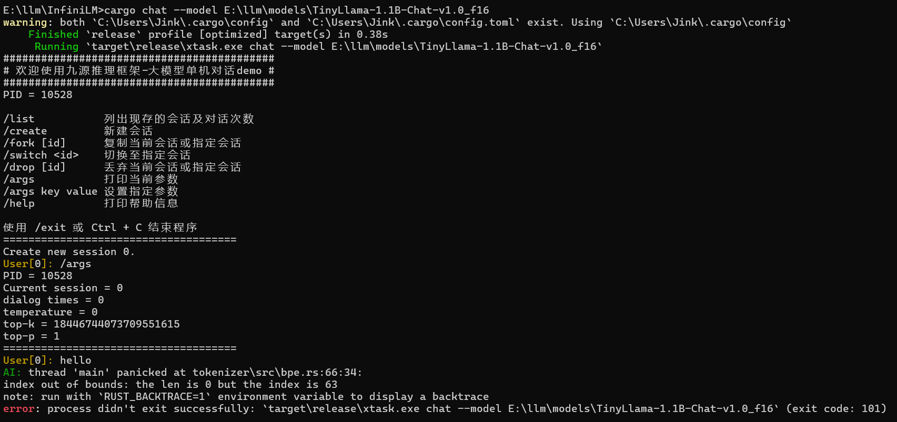

# 导学阶段常见问题

1. 除了 C++ 和 Rust 还需要什么专业基础嘛？

   > 材料还在整理和补充，会陆续放出。
   >
2. 直播有回放吗？

   > 有的，每个阶段中的学习视频栏目中将可见每次课程直播回放。
   >
   > 样例可见导学中关于 [OS 训练营大模型引擎项目课程](https://opencamp.cn/os2edu/camp/2024spring/stage/10?tab=video)。
   >
3. C++ 或者 Rust 对后续专业阶段和项目阶段有什么影响吗？

   > AI 编译器采用 C++ 实现，大模型推理引擎采用 Rust 实现。鼓励学员们选择多个方向，难度都不是特别大，专业阶段中不同方向的上课时间也不同，不用担心上课时间冲突。
   >
4. InfiniTensor 拉取失败怎么办？

   > 这个项目通过 http 进行拉取会出现没有权限的问题，需配置 Github ssh 密钥来通过 ssh 进行克隆到本地操作：
   >
   > **第一步：检查本地主机是否已经存在 ssh key**
   >
   > ```shell
   > cd ~/.ssh
   > ls
   > # 查看是否已存在 id_rsa 和 id_rsa.pub 文件
   > # Windows 系统则查看 C:\Users\<Your Username>\.ssh 文件夹下
   > # 存在可直接看第三步
   > ```
   > **第二步：生成 ssh key**
   >
   > ```shell
   > ssh-keygen -t rsa -C "xxx@xxx.com"
   > # 一直回车即可
   > # Windows 系统下同理，不想要后面一串也可以直接运行 ssh-keygen 指令
   > ```
   > **第三步：获取 ssh key 公钥内容并添加到 Github**
   >
   > 复制 `id_rsa.pub` 文件内的内容，之后 Github 右上角点击头像->Settings->SSH and GPG keys->右上角蓝色 New SSH key 按钮->将复制的内容粘贴到 Key 输入框中添加 title 以便管理->最后点击 Add SSH key 即可。
   >
   > 验证是否配置 ssh 公钥成功可运行 `ssh -T git@github.com` 指令，看见输出 `Hi xxx! You've successfully authenticated, ...` 即可。
   >
   > 之后即可运行 `git clone git@github.com:InfiniTensor/InfiniTensor.git` 克隆 InfiniTensor 到本地。
   >
5. 关于导学阶段安排

   > 目前导学阶段直接在[社区网站](https://opencamp.cn/InfiniTensor/camp/2024summer/stage/0)阅览学习即可，以及尝试[导学实践内容](../profile/README.md#导学阶段实践-)。
   >
6. 关于后续基础阶段内容问题

   > 后续基础阶段分为 C++ 基础和 Rust 基础，目前导学阶段若没有 Rust 基础建议可以尝试学习，Rust 方向可提前练习[Rustlings](https://github.com/rust-lang/rustlings/)（之后基础阶段：Rust 基础方向也将以此为阶段评测），C++ 方向的测评题目还在编写，目前只能自行复习练习。
   >
7. InfiniLM 运行报错怎么办？

   > 
   >
   > **关键字**：`index out of bounds:`
   >
   > 遇到以上输出为模型（model.safetensors）文件拉取不完整导致，对于 lfs 大文件需要手动下载放入模型文件中。
   >
   > 另外，运行 InfiniLM 需要将 Rust 版本更新至最新的 1.79.0 以上，即最新的 stable 或更高的 nightly。
   >
8. 用 InfiniLM 对话，模型不会说中文怎么办？

   > 目前 InfiniLM 只支持 Llama。推荐模型 TinyLlama 的中文能力可能较弱，原因包括下列 3 点：
   >
   > 1. 未设置或设置了错误的采样参数，导致采样效果差；
   > 2. 采样中有些技巧可以控制输出的长度和风格目前并未实现于 InfiniLM；
   > 3. 模型本身的中文能力确实较差；
   >
9. 关于社区平台的课程录播问题

   > 遇到录播视频加载不出来可稍微等待或进行刷新，此为先前录制时的平台问题。
   >
10. 这个训练营和编译器有啥关系？

    > 其实深度学习编译器和编译器是两个东西，就好像javascript和java是两个东西
    > 也可参考[AI编译器与传统编译器的联系与区别](https://blog.csdn.net/weixin_44966641/article/details/121629901)
    >
11. 后续的AI编译器主要是做cuda后端的吗？

    > 考虑到显卡持有量原因，cuda是一个单独方向（课也是单独的，作业也是单独的）；AI编译器方向主要讲硬件无关的框架和优化知识
    > Q：主要是概念吗？有没有深入理解或者实战写pass这些环节？
    > A：第一节课主要讲概念和框架结构，后面几节课都和项目联系挺紧密的，会结合代码举例介绍优化技巧
    >
12. 后期的编译器项目，是在InfiniTensor还是RefactorGraph基础上做的？

    > 这个暂时没有定，近期会确定好告诉大家，讲课时两个框架都会介绍
    >
13. 训练营的C++使用什么标准？

    > InfiniTensor使用C++17；RefactorGraph使用C++20
    >
14. ...
