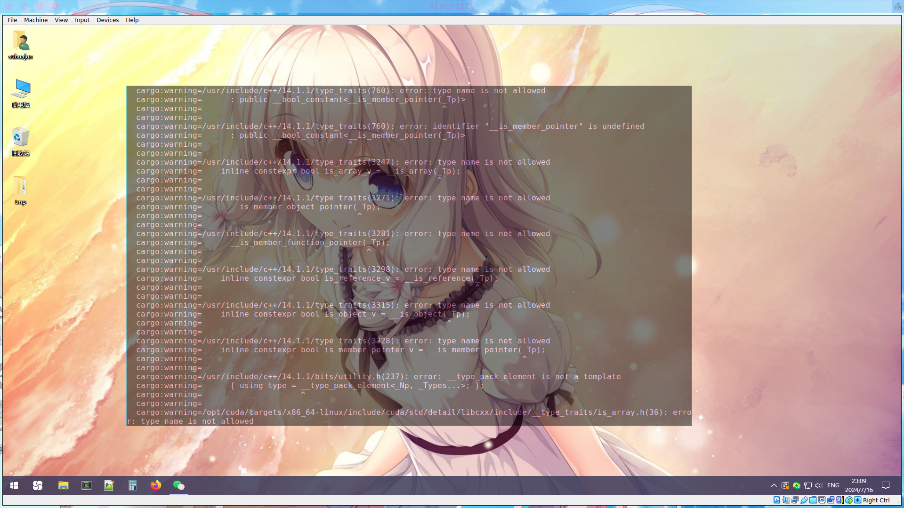
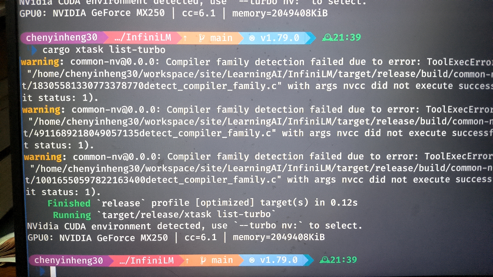
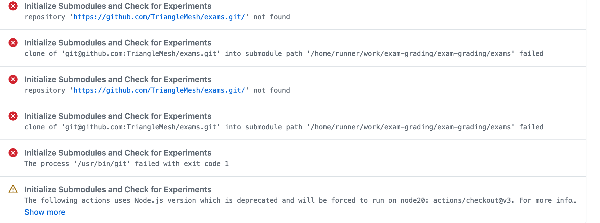
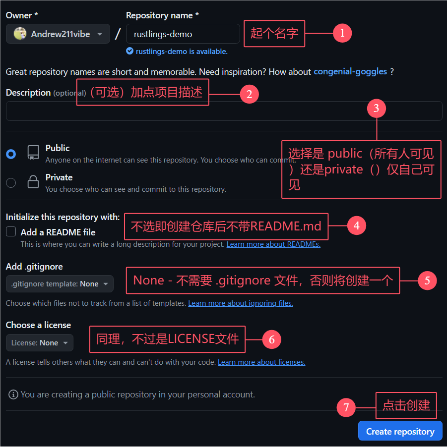
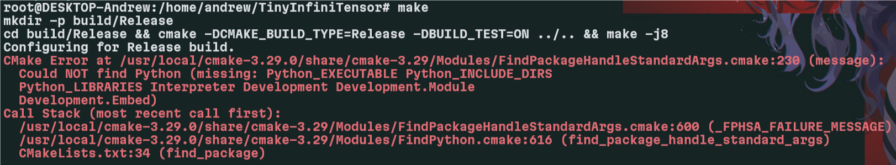
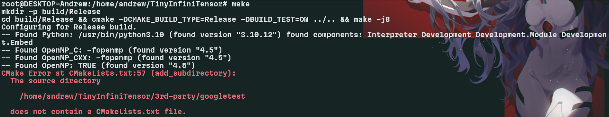

# InfiniTensor训练营（2024夏季）Q&A文档

## 导学阶段常见问题

1. 除了 C++ 和 Rust 还需要什么专业基础嘛？

   > 材料还在整理和补充，会陆续放出。

2. 直播有回放吗？

   > 有的，每个阶段中的学习视频栏目中将可见每次课程直播回放。
   >
   > 样例可见导学中关于 [OS 训练营大模型引擎项目课程](https://opencamp.cn/os2edu/camp/2024spring/stage/10?tab=video)。

3. C++ 或者 Rust 对后续专业阶段和项目阶段有什么影响吗？

   > AI 编译器采用 C++ 实现，大模型推理引擎采用 Rust 实现。鼓励学员们选择多个方向，难度都不是特别大，专业阶段中不同方向的上课时间也不同，不用担心上课时间冲突。

4. InfiniTensor 拉取失败怎么办？

   > 这个项目通过 http 进行拉取会出现没有权限的问题，需配置 Github ssh 密钥来通过 ssh 进行克隆到本地操作：
   >
   > **第一步：检查本地主机是否已经存在 ssh key**
   >
   > ```shell
   > cd ~/.ssh
   > ls
   > # 查看是否已存在 id_rsa 和 id_rsa.pub 文件
   > # Windows 系统则查看 C:\Users\<Your Username>\.ssh 文件夹下
   > # 存在可直接看第三步
   > ```
   >
   > **第二步：生成 ssh key**
   >
   > ```shell
   > ssh-keygen -t rsa -C "xxx@xxx.com"
   > # 一直回车即可
   > # Windows 系统下同理，不想要后面一串也可以直接运行 ssh-keygen 指令
   > ```
   >
   > **第三步：获取 ssh key 公钥内容并添加到 Github**
   >
   > 复制 `id_rsa.pub` 文件内的内容，之后 Github 右上角点击头像->Settings->SSH and GPG keys->右上角蓝色 New SSH key 按钮->将复制的内容粘贴到 Key 输入框中添加 title 以便管理->最后点击 Add SSH key 即可。
   >
   > 验证是否配置 ssh 公钥成功可运行 `ssh -T git@github.com` 指令，看见输出 `Hi xxx! You've successfully authenticated, ...` 即可。
   >
   > 之后即可运行 `git clone git@github.com:InfiniTensor/InfiniTensor.git` 克隆 InfiniTensor 到本地。

5. 关于导学阶段安排

   > 目前导学阶段直接在[社区网站](https://opencamp.cn/InfiniTensor/camp/2024summer/stage/0)阅览学习即可，以及尝试[导学实践内容](../profile/README.md#导学阶段实践-)。

6. 关于后续基础阶段内容问题

   > 后续基础阶段分为 C++ 基础和 Rust 基础，目前导学阶段若没有 Rust 基础建议可以尝试学习，Rust 方向可提前练习[Rustlings](https://github.com/rust-lang/rustlings/)（之后基础阶段：Rust 基础方向也将以此为阶段评测），C++ 方向的测评题目还在编写，目前只能自行复习练习。

7. InfiniLM 运行报错怎么办？

   > 详情请见 [InfiniLM 指南/常见问题](https://github.com/InfiniTensor/InfiniLM/blob/main/docs/user-guide/doc.md#%E8%BF%90%E8%A1%8C%E4%B8%AD%E7%9A%84%E5%B8%B8%E8%A7%81%E9%97%AE%E9%A2%98)，若未能找到问题解决方法请在群里提问或找老师解决。

8. 用 InfiniLM 对话，模型不会说中文怎么办？

   > 目前 InfiniLM 只支持 Llama。推荐模型 TinyLlama 的中文能力可能较弱，原因包括下列 3 点：
   >
   > 1. 未设置或设置了错误的采样参数，导致采样效果差；
   > 2. 采样中有些技巧可以控制输出的长度和风格目前并未实现于 InfiniLM；
   > 3. 模型本身的中文能力确实较差；

9. 关于社区平台的课程录播问题

   > 遇到录播视频加载不出来可稍微等待或进行刷新，此为先前录制时的平台问题。

10. 这个训练营和编译器有啥关系？

    > 深度学习编译器和编译器是两个东西，就好像 javascript 和 java 是两个东西。
    >
    > 或参考知乎问答[神经网络的编译器和传统编译器的区别和联系是什么？](https://www.zhihu.com/question/396105855)

11. 后续的AI编译器主要是做cuda后端的吗？

    > 考虑到显卡持有量原因，cuda是一个单独方向（课也是单独的，作业也是单独的）。
    >
    > AI 编译器方向主要讲硬件无关的框架和优化知识。
    >
    > Q：主要是概念吗？有没有深入理解或者实战写 pass 这些环节？
    >
    > A：第一节课主要讲概念和框架结构，后面几节课都和项目联系挺紧密的，会结合代码举例介绍优化技巧。

12. 后期的编译器项目，是在InfiniTensor还是RefactorGraph基础上做的？

    > 这个暂时没有定，近期会确定好告诉大家，讲课时两个框架都会介绍。

13. 训练营的 C++ 使用什么标准？

    > - InfiniTensor使用 C++17；
    > - RefactorGraph 使用 C++20；

14. 有没有正式课程的文档？对于有Rust经验的学生可以先看看正式课程

    > 暂时还没有，有基础的可以看[上期训练营的回放](https://opencamp.cn/os2edu/camp/2024spring/stage/10?tab=video)

15. InfiniLM不用Nvidia显卡能运行吗？

    > 可以的，不过现在即使不用Nvidia显卡，检测到环境也会编译。也可以在 `xtask/Cargo.toml` 里关掉默认 `features` 解决。
    >
    > ```toml
    > ...
    >
    > [features]
    > default = ["nvidia", "cambricon"] # 去掉nvidia即可
    > nvidia = ["llama-nv", "llama-nv-distributed"]
    > cambricon = ["llama-cn"]
    > ```

16. cpp和rust的题是开营后才公布吗？

    > 正在开发中，不过在开营前肯定会准备好公布给大家，最早可能下周公布。

17. rustling可以用之前训练营的rustling替代吗？

    > 我们会用更新版的，题目差别不大但是用法不同。

18. 基础阶段的cxx和rust题目都是什么类型？算法题吗？

    > cxx题目类型类似rustlings，语法部分占大多，并做了一个类似rustlings的学习软件，难度都比较低。

19. 项目有没有整体架构图可以看看？

    > 暂时还没，开发不久，架构变化还挺激烈，不过后续课程会根据现有的画一个。

20. AI编译器方向需要先学线代吗？

    > 我们几乎不搞训练，至少不开发训练框架，所以几乎不需要微积分；概率论只有采样的时候需要一点；项目应用中主要是最基础的线性代数，矩阵乘和转置。

21. 如何判断InfiniLM是仅CPU运行的还是CUDA运行的？

    > 要是运行时没传递 `--turbo nv` 参数就就没有使用CUDA运行了，就是用CPU推理运行。
    > 

22. 如果InfiniLM运行 `cargo xtask list-turbo` 没有返回可用的Turbo hardware 怎么办？

    > 若设备确实存在N卡，这种情况为检测不到你的CUDA，一般来说看一下环境变量 `$CUDA_ROOT`。
    > **NOTICE** Windows环境下可通过 powershell `$env:CUDA_ROOT` 进行查看。Linux则使用 `echo $CUDA_ROOT` 查看
    > 若没有则需要检查 CUDA toolkit 的安装后再试，确认装好了 CUDA toolkit，然后设置 `CUDA_ROOT` 环境变量，之后运行 `cargo clean` 后再重新编译运行。
    > - 若编译运行后产生大量warnings且报错失败：
    > 
    > 可以选择：
    > i. `export CXX=g++-13` 指定 g++ 编译器版本，再次编译运行
    > ii. 换个干净环境重新来（docker）
    > iii. 弃坑关了 cuda features 退回 CPU
    >
    > 理想运行输出：
    > 

23. 模型需要多少显存，2GB好像不够

    > 平时用的大概 6G 显存可以跑 2B 模型，理论上 2G 跑 1B 够用的但是系统总要占点。目前量化还在开发中，近期我们看看能不能找一些更小的模型跑起来。

24. InfiniLM推荐在wsl运行还是直接在win运行啊？

    > win 环境能配好就推荐 win，wsl2 磁盘速度受限

25. InfiniLM是怎么检测CUDA的？

    > InfiniLM通过调用 [find_cuda_helper](https://crates.io/crates/find_cuda_helper) 查找CUDA环境

26. 运行 `exam-grading` 提交评测报错找不到子模块

    > 
    > 以上输出一般是因为添加的子模块GitHub仓库权限为private导致的，将要添加为子模块的仓库权限设置为public即可。

27. 除了 `TinyLlama` 还有没有其他能在InfiniLM框架中运行的更大的模型？

    > 可以上 huggingface 上寻找一下，不过Llama 2和3在模型结构上兼容，但 `tokenizer` 不兼容，导致跑不起来。
    > 也可以看一下启元推出的九格8B模型：[模型仓库 README](https://www.osredm.com/jiuyuan/CPM-9G-8B/tree/master/quick_start_clean/readmes/README_ALL.md)

28. 用的mac air，配置在后续跟不跟的上呢？

    > CUDA方向不行，其它都没问题

29. exam-grading：如果 initialize submodules and check for experiments 成功了，但是 test job for other submodules 跳过了是什么原因？

    > 原因是没检测到 `exams` 目录，test job for other submodules 这个任务只有在检测到 `exams` 目录存在才会运行

30. 是否也能让 InfiniLM 支持 AMD 的显卡呢？

    > 暂时没有这个支持计划，NVIDIA 之后是国产硬件，

31. Mac 的 GPU 是不是还没有支持？

    > 由于不知道 Mac 的 GPU 如何开发，就当 Mac 没有 GPU吧

32. opencamp 网站上的组队机制有什么作用？后续是会有以团队为单位的任务吗？

    > 组队就是给大家组成小团体互相交流学习的功能，后续并不会有团队为单位的任务，不强制组队，训练营本身评价机制是个人性质的。

33. exam-grading 是在之前 rustlings 基础上做的改版么？我们在基础阶段需要把这个题目刷完，作为 rust 基础过关的认证是么？

    > exam-grading是用来后续评测的，现在是让大家熟悉使用流程，后续就只用专注做题就行，关于后续基础阶段相关的内容和exam-grading的使用会在今晚更新

34. 请问后面的阶段是必须要组队才能晋级吗？

    > 训练营为个人性质，不强制组队，组队是为了交流方便一点

35. 组队有截止日期吗？

    > 没有，随时都可以

36. AI编译器会用到MLIR吗？

    > 会的

37. cpp 和 Rust 是同时学习还是选择一个语言学习？

    > 两个是同步进行的，只完成一个方向就能够晋级，有余力的话推荐都试试

38. InfiniLM会对昇腾芯片适配么？

    > 已经在做了（指新建Github仓库）

## 基础阶段常见问题

1. 基础阶段的题在哪里？

   > [C++基础：learning-cxx](https://github.com/LearningInfiniTensor/learning-cxx) 和 [Rust基础：rustlings](https://rustlings.cool/)
   > 习题提交评分参考：[自动评分系统使用说明](https://github.com/LearningInfiniTensor/.github/blob/main/exam-grading-user-guide/doc.md)

2. 基础阶段 `rustlings` 和 `learning-cxx` 的问题

   > 详情请见：[习题Q&A](../exam-grading-user-guide/doc.md#习题qa)

3. 习题怎么用？评测系统怎么用？

   > 1. Rust 习题，参考 [rustlings](https://rustlings.cool/) 官网步骤部署到本地，可以看基础阶段第一课，杨老师演示了使用方式。之后将本地代码推送到一个新的空的Github仓库（创建时候不勾选 `README` 和 `.gitignore` 即可）
   > 
   > 2. Cpp 习题，使用方式和导学阶段的测试题方法类似，只是[源码](https://github.com/LearningInfiniTensor/learning-cxx)需要用 fork 拉取、子模块/目录需要命名为 `learning-cxx`，然后 push 到远程仓库。
   > 3. 评测系统，看[导学阶段](https://opencamp.cn/InfiniTensor/camp/2024summer/stage/0?tab=video)里，有录制的视频，讲解评测系统的使用。

4. 为什么我的习题无法 push 到远程仓库？

   > 因为并没有正确获取习题，一般出现于直接克隆了 `learning-cxx` 而没有 fork 之后再克隆自己的，导致没有权限修改了也无法推送；

5. 已经完成了习题，并且添加了子模块，为什么没有成绩？

   > 可能是你没有重新推送 `exam-grading`，评分只有向 `exam-grading` 提交或手动运行，可观看 [导学阶段-评分系统使用视频](https://opencamp.cn/InfiniTensor/camp/2024summer/stage/0?tab=video)

6. 为什么我的成绩出现在了导学阶段排行榜，而没有在基础阶段排行榜？

   > 原因可能有两个：
   >
   > 1. 子模块命名不对
   > 2. 没更新 exam-grading
   >
   > 请自行排查
   >
   > 1. 原因一解决方式：通过移除子模块重新加入或自行修改子模块相关文件修复
   > 2. 原因二解决方式：通过删除 Github 以及本地评分系统并重新根据 template 创建后拉取到本地
   >
   > **NOTICE** 以上操作均可参考 [Exam Grading使用教程](../exam-grading-user-guide/doc.md)

7. 请问“方向二 算力硬件适配”的硬件最低标准是啥？1050ti可以吗？

   > 可以

8. 别的语言泛型都是咋做的 也是单态化吗？

   > `C#` 是真泛型，也是类似模板的实现，有不同模板参数的类型是无关类型。`Java` 是类型擦除泛型，泛型只体现在编译期，编译后具有相同的布局，相当于所有参数类型都转化为 `void*`。所以 `Java` 的泛型参数不能是基本类型。

9. 老师，请问 `InfiniLM` 现在支持 mixtral 吗？我看 models 里有个 mixtral 目录

   > 支持 cpu 的，如果你有能放下一整个 mixtral 的内存就能跑。cuda版本写好了，但还没推上去，然而一般人也没那么多显存

10. 项目选题介绍会怎么在学了方向之后开啊

    > 方向选择是专业阶段给大家选择自己感兴趣的方向，是基础阶段的具体应用，并教给大家对应方向的相关知识并布置一些小作业。之后的项目阶段是给大家进行了基础阶段和专业阶段之后的自己实践的机会。

11. learning-cxx 提交到评分系统后运行时间很久？

    > 大概是Fibonacci的记忆化搜索实现不正确，时间复杂度过高，导致一直在计算，请查看修改

12. 专业阶段是写项目还是作业？

    > - 大模型推理系统方向作业和项目是一起的，项目是作业的延续；
    > - AI 编译器方向专业阶段是写作业，项目阶段参与 InfiniTensor/RefactorGraph 开发
    > 

13. 高性能计算那个方向要配置硬件的吗？

    > 后续介绍cuda编程的时候需要用到显卡

14. 没显卡能选哪个方向？

    > 本地没有显卡就得组服务器了，除了算力硬件适配方向以外，其他项目都只需要 CPU。

15. 算力硬件适配方向显卡的最低配是？

    > 算力硬件适配方向显卡只需支持 CUDA 即可，对计算能力没啥要求

16. 一定要把基础阶段的题写完才能参加后续的项目吗？

    > 听课当然可以听，都是公开的，但是 1.不能进专业阶段群 2. 做完专业习题也不能晋级

17. 过了时间，做完了基础阶段习题也晋级不了了是吗？

    > 没有截止时间，什么时候做完什么时候晋级，但是太晚可能就没意义了，讨论啥的就错过了，所以大家尽量肝一肝在8月4日之前完成习题。

18. 为什么 vscode 没有代码补全和函数提示呀？已安装了 rust-analyzer 插件。

    > 在嵌套多项目的时候 rust-analyzer 要设置一下，不然它不会递归解析。rustlings 的话好像是有一个命令直接帮你生成一个 rust-analyzer 的配置文件

19. 是不是只要导学阶段的模型能运行，后续除了算力硬件适配方向，需要支持 CUDA 的显卡，其它方向就没有特定的设备要求了？能跑起来导学阶段的模型就足够了嘛

    > 基本是这样，AI 编译器方向在专业阶段会给一个简化版的 AI compiler 供大家快速上手学习，只需要在 CPU 上跑。项目阶段在 InfiniTensor 和 RefactorGrapgh 中进行选题开发，这两个项目都支持多设备后端，包括 CPU。

20. ... 

## 专业阶段常见问题

1. 如何部署TinyInfiniTensor？

   > [InfiniTensor项目部署](https://github.com/LearningInfiniTensor/TinyInfiniTensor/blob/main/docs/%E9%A1%B9%E7%9B%AE%E9%83%A8%E7%BD%B2.md)

2. 没安装显卡驱动出现：`Driver Version: 555.85 CUDA Version: 12.5` ,是不是不用安装 Linux 驱动了?我的显卡是 1060 5G ,官网搜 1060 得到到的 `NVIDIA-Linux-x86_64-550.107.02` 版本低,还装不上

   > 测试是否能跑 [CUDA代码](https://github.com/xgqdut2016/cuda_code)，如果能跑这里面的代码，说明就OK了

3. 训练营通关了有实习机会吗？

   > 到时候可联系老师获取详情

4. 最后的项目阶段是和专业阶段的方向有关吗？

   > 没有约束关系，无论专业阶段做完什么作业只要晋级，项目阶段仍然可以随意选。但是一些项目和专业阶段作业是承接关系，如果专业阶段的部分没做，项目可能会做的不顺利。

5. 编译 `TinyInfiniTensor` 过程中 CMake 报错找不到 Python。

   > 
   > 运行指令 `apt-get install python3-dev` 即可

6. 编译 `TinyInfiniTensor` 过程中 CMake subdirectory 报错。

   > 
   > 因为项目子模块为初始化拉取，运行指令 `git submodule update --init` 即可

7. 在 WSL 上执行 `nvidia-smi` 无法读取显卡并输出 `Segmentation Fault`，但在 Windows 上能正常输出。

   > 参考 [nvidia-smi segmentation fault in wsl2 but not in Windows](https://github.com/microsoft/WSL/issues/11277) 尝试降低驱动版本。

8. ...
