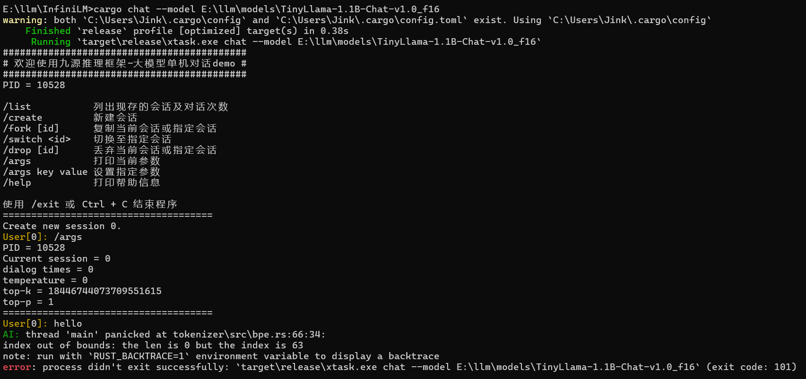

# 导学阶段常见问题

1. 除了cpp和rust还需要什么专业基础嘛？

   > 材料还在整理和补充，会陆续放出
   >
2. 直播有回放吗？

   > 有的，每个阶段中的学习视频栏目中将可见每次课程直播回放
   >
   > - 样例可见导学中关于OS训练营大模型引擎项目课程：[https://opencamp.cn/os2edu/camp/2024spring/stage/10?tab=video](https://opencamp.cn/os2edu/camp/2024spring/stage/10?tab=video)
   >
3. C++或者Rust对后续专业阶段和项目阶段有什么影响吗，比如某一方向要求是Rust

   > AI编译器是cpp做的，大模型推理是Rust做的。我们鼓励学员们选择多个方向，难度都不是特别大，专业阶段中不同方向的上课时间也不同，不用担心上课时间冲突
   >
4. 关于InfiniTensor拉取

   > 这个项目通过http进行拉取会出现没有权限的问题，需配置Github ssh密钥来通过ssh进行克隆到本地操作：
   > **第一步：检查本地主机是否已经存在ssh key**
   >
   > ```shell
   > cd ~/.ssh
   > ls
   > # 查看是否已存在id_rsa和id_rsa.pub文件
   > # Windows系统则查看C:\Users\<Your Username>\.ssh文件夹下
   > # 存在可直接看第三步
   > ```
   >
   > **第二步：生成ssh key**
   >
   > ```shell
   > ssh-keygen -t rsa -C "xxx@xxx.com"
   > # 一直回车即可
   > # Windows系统下同理，不想要后面一串也可以直接运行ssh-keygen指令
   > ```
   >
   > **第三步：获取ssh key公钥内容并添加到Github**
   >
   > 复制 `id_rsa.pub`文件内的内容，之后Github右上角点击头像->Settings->SSH and GPG keys->右上角蓝色New SSH key按钮->将复制的内容粘贴到Key输入框中添加title以便管理->最后点击Add SSH key即可
   > 验证是否配置ssh公钥成功可运行 `ssh -T git@github.com`指令，看见输出 `Hi xxx! You've successfully authenticated, ...`即可
   > 之后即可运行 `git clone git@github.com:InfiniTensor/InfiniTensor.git`克隆InfiniTensor到本地
   >
5. InfiniLM支持问题

   > 目前InfiniLM只支持Llama。对于中文输入，一个方面是使用模型的中文能力问题，另外采样中有些技巧可以控制输出的长度和风格目前并未实现于InfiniLM，设置一下采样参数会好些
   >
6. 关于导学阶段安排

   > 目前导学阶段直接在[社区网站](https://opencamp.cn/InfiniTensor/camp/2024summer/stage/0)阅览学习即可，以及尝试导学实践内容 -- 部署运行InfiniLM到本地
   >
7. 关于后续基础阶段内容问题

   > 后续基础阶段分为C++基础和Rust基础，目前导学阶段若没有Rust基础建议可以尝试学习，Rust方向可提前练习[Rustlings](https://github.com/rust-lang/rustlings/)（之后基础阶段-Rust基础方向也将以此为阶段评测），C++方向的测评题目还在编写，目前只能自行复习练习
   >
8. 关于InfiniLM运行问题

   > 
   >
   > - 遇到以上输出为模型（TinyLlama）文件拉取不完整导致，对于lfs大文件需要手动下载放入模型文件中
   > - 关于Rust环境，运行InfiniLM需要将Rust版本更新至最新的stable（1.79.0），或者大于等于这个版本的nightly也行
   >
9. 关于社区平台的课程录播问题

   > 遇到录播视频加载不出来可稍微等待或进行刷新，此为先前录制时的平台问题
   >
10.
